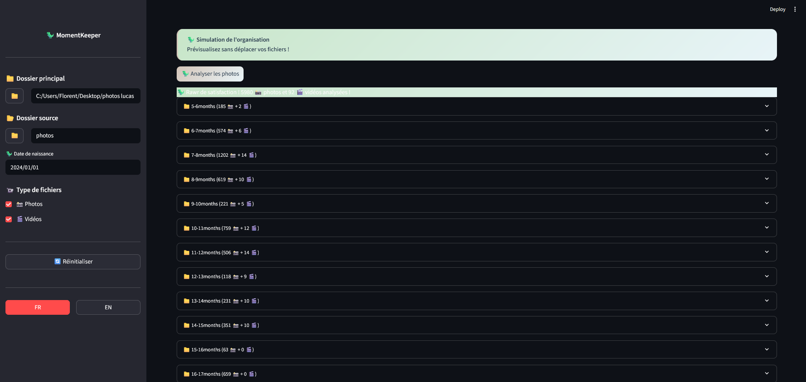
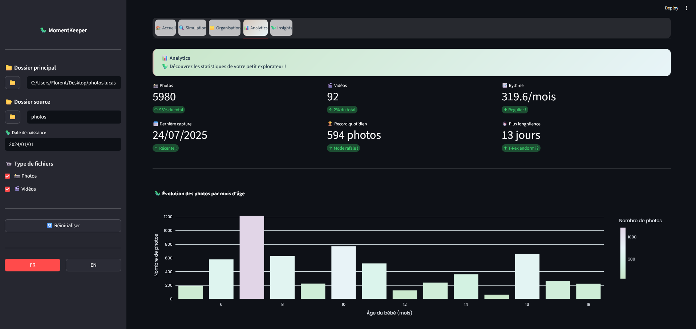
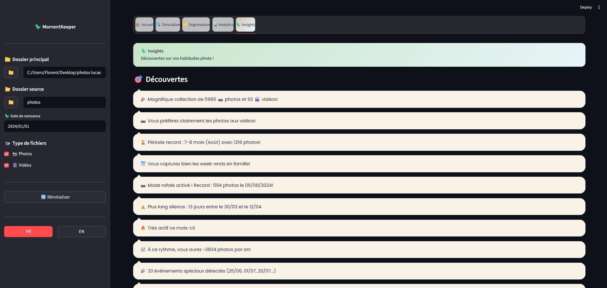

# MomentKeeper

[](https://www.python.org/downloads/)
[](https://streamlit.io)
[](https://opensource.org/licenses/Apache-2.0)
[](https://github.com/psf/black)

🦖🍼 **Automatic (Baby) Photo & Video Organizer** - Organize precious moments chronologically with intelligent automation.

## 🎯 Overview

MomentKeeper automatically organizes baby photos and videos into monthly folders based on birth date and timestamps extracted from filenames.
Transform thousands of media files from chaos to chronological perfection in minutes.

## 📸 Screenshots

<div align="center">

| Simulation Preview | Analytics Dashboard | Insights |
|:-----------------:|:------------------:|:--------:|
|  |  |  |
| *Preview organization before moving files* | *Track your photo habits with detailed metrics* | *Discover patterns in your photo collection* |

</div>

## ✨ Features

- **Smart Organization**: Automatically sorts photos and videos into monthly folders (0-1months, 1-2months, etc.)
- **Media Support**: Handles photos (.jpg, .jpeg, .png, .heic, .webp) and videos (.mp4, .mov, .avi, .mkv, .m4v, .3gp, .wmv)
- **Date Intelligence**: Extracts dates from filename patterns (`YYYYMMDD_description.jpg`)
- **Multilingual Interface**: Available in French and English with persistent language preference
- **Analytics Dashboard**: Track your photo habits with insights and visualizations
- **Gallery View**: Browse organized photos with multiple viewing modes (random, chronological, highlights, timeline)
- **Baby's Name Personalization**: Add your baby's name for personalized messages and insights
- **Configuration Persistence**: Settings are saved automatically and restored on next launch
- **Safe Operation**: Simulation mode before actual organization
- **Reset Capability**: Undo organization if needed
- **Error Handling**: Robust handling of invalid dates and file formats
- **Interactive Folder Selection**: Browse and select folders with native dialogs

## 🛠️ Technical Architecture

### Core Modules
- `OrganisateurPhotos`: Main organization logic with calendar-accurate age calculation
- `PhotoCopier`: Safe file operations with move/copy capabilities
- `Analytics`: Photo statistics, insights generation, and visualizations
- `Config`: Centralized configuration management
- `ConfigManager`: Persistent configuration storage in JSON format
- `Theme`: UI styling and color palette
- `Translations`: Multilingual support (FR/EN)

### Workflow
1. **Configuration**: Set root folder, photos subfolder, and baby's birth date
2. **Simulation**: Preview organization without moving files
3. **Confirmation**: User validates the plan
4. **Organization**: Execute the actual file organization
5. **Reset**: Optional rollback capability

## 📁 Project Structure

### Input
```
project-folder/           (root directory)
└── photos/              (subfolder with photos to organize)
    ├── 20240315_first_smile.jpg
    ├── 20240420_crawling.jpg
    ├── 20240515_sitting_up.jpg
    └── ...
```

### Output
```
project-folder/           (root directory)
├── photos/              (original photos subfolder)
├── 0-1months/           (organized by age - created in root)
│   └── 20240315_first_smile.jpg
├── 1-2months/
│   └── 20240420_crawling.jpg
├── 2-3months/
│   └── 20240515_sitting_up.jpg
└── ...
```

## 🚀 Quick Start

### Create a virtual environment

```bash
# Windows
python -m venv venv
venv\Scripts\activate

# Linux/MacOS
python -m venv venv
source venv/bin/activate
```

### Install and run

```bash
# Install dependencies
pip install -r requirements.txt

# Run the Streamlit web interface
streamlit run app.py
```

## 🖥️ Usage

### Streamlit Web Interface
1. **Configure paths**: Select root directory and photos subfolder using browse buttons
2. **Set birth date**: Choose baby's birth date with date picker
3. **Add baby's name** (optional): Personalize messages and insights
4. **Select file types**: Choose to organize photos, videos, or both
5. **Simulate**: Preview organization with "Analyser les photos"
6. **Organize**: Confirm and run actual organization
7. **Explore Analytics**: View statistics and insights about your photo collection
8. **Browse Gallery**: View organized photos with different display modes
9. **Reset**: Undo organization if needed

All settings are automatically saved and restored on next launch.


## 🔧 Configuration

- **Root Directory**: Main project folder containing photos subfolder
- **Photos Subfolder**: Subdirectory with photos to organize (default: "photos")
- **Birth Date**: Baby's birth date for precise age calculations
- **Baby's Name** (optional): Personalize the experience with your baby's name
- **File Pattern**: Supports `YYYYMMDD_description.ext` format for all media types
- **File Types**: Choose between photos only, videos only, or both
- **Language**: French or English interface (preference saved)
- **Configuration File**: Settings saved in `~/.momentkeeper/momentkeeper_config.json`

## 🎨 User Interface

**Streamlit Web App Features:**
- Native folder browsing with tkinter dialogs
- Dual path configuration (root + subfolder)
- Date picker with validation
- Baby name personalization
- Real-time simulation preview
- Progress tracking and detailed error reporting
- Debug information for ignored files
- One-click reset functionality
- Analytics dashboard with charts and insights
- Interactive photo gallery with 4 viewing modes:
  - Random: Discover forgotten memories
  - Chronological: View photos in date order
  - Highlights: See the most photo-heavy days
  - Timeline: One photo per month showing growth
- Age badges on gallery photos showing baby's age when taken
- Adaptive photo count slider based on baby's current age
- Language selector (FR/EN) with persistent preference
- T-Rex themed UI with pastel colors
- All tabs always accessible for better navigation

## 🛡️ Safety Features

- **Simulation First**: Always preview before acting
- **File Validation**: Check file existence and format
- **Calendar-Accurate Age Calculation**: Proper month-based age calculation
- **Error Recovery**: Graceful handling of edge cases and file conflicts
- **Rollback Capability**: Complete reset to original state

## 📋 Development Status

- ✅ Core organization logic with accurate age calculation
- ✅ Cross-platform path handling
- ✅ Complete Streamlit interface
- ✅ Jupyter notebook integration
- ✅ Advanced error handling and debugging

## 💡 Use Cases

- **New Parents**: Organize growing photo collections
- **Family Archives**: Sort historical baby photos
- **Photo Enthusiasts**: Maintain chronological photo libraries
- **Memory Keeping**: Create timeline-based photo albums

## 📈 Performance

- **High Speed**: Processes ~750,000 photos per minute
- **Low Memory**: < 35MB RAM usage for 10,000+ files
- **Scalable**: Tested efficiently from 100 to 10,000+ photos
- **Cross-Platform**: Verified on Windows 11, Python 3.13

### Supported Filename Patterns
- ✅ `20240315_photo.jpg` - Standard format
- ✅ `20240315_long_description.jpg` - With description
- ✅ `20240315_été_vacances.jpg` - Special characters
- ❌ `2024-03-15_photo.jpg` - Hyphens not supported
- ❌ `photo_20240315.jpg` - Date must be at start

### File Size Support
- **All formats**: Successfully tested up to 1GB per file
- **Path compatibility**: Supports spaces and special characters in folder names
- **Memory efficient**: Linear scaling with collection size

### Known Limitations
- Filename pattern must include `YYYYMMDD_description` format
- Date extraction from filenames only (EXIF support planned for v2.0)
- Requires Python 3.8+ and dependencies listed in requirements.txt

> 💡 **Benchmark results** based on real testing with the included benchmark scripts in `/scripts/`

## 🚀 Development

### Running Tests
```bash
# Install development dependencies
pip install -r requirements-dev.txt

# Install pre-commit hooks (recommended)
pre-commit install

# Run code formatting manually
black src tests
isort src tests

# Run linting manually
ruff check src tests

# Run all pre-commit hooks manually
pre-commit run --all-files

# Run tests (when implemented)
pytest
```

### Project Structure
```
moment-keeper/
├── src/moment_keeper/       # Main package
│   ├── organizer.py         # Core organization logic
│   ├── photo_copier.py      # File operations
│   ├── analytics.py         # Statistics and insights
│   ├── config.py            # Configuration constants
│   ├── config_manager.py    # Persistent configuration
│   ├── theme.py             # UI theming
│   └── translations.py      # i18n support
├── app.py                   # Streamlit web interface
├── notebooks/               # Jupyter notebooks
├── tests/                   # Unit tests
└── requirements*.txt        # Dependencies
```

## 🤝 Contributing

We welcome contributions! To maintain code quality:

### Setup
```bash
# Install development dependencies
pip install -r requirements-dev.txt

# Install pre-commit hooks (required)
pre-commit install
```

### Before submitting
- ✅ Run `pre-commit run --all-files` to check formatting and linting
- ✅ Ensure all tests pass (when available)
- ✅ Follow existing code patterns and conventions
- ✅ Update documentation if needed

### Code quality tools
- **black**: Code formatting
- **isort**: Import sorting
- **ruff**: Fast Python linting
- **pre-commit**: Automated checks before commit

## 📝 License

This project is licensed under the Apache License 2.0 - see [LICENSE](LICENSE) for details.

If you use MomentKeeper in your project, a mention would be appreciated! 🦖

## 🏆 Acknowledgments

- Inspired by the chaos of 10,000 unsorted baby photos
- T-Rex mascot because parenting is like having a tiny dinosaur 🦖

---

*Built with ❤️ for preserving precious family moments*
